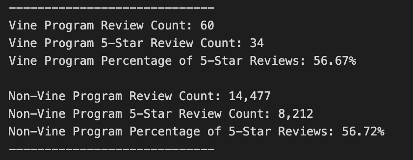
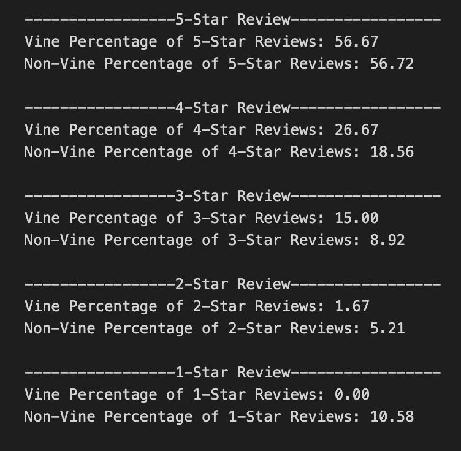

# Amazon Vine Analysis

## Overview of Project

### Purpose

The purpose of this project is to perform an analysis of Amazon reviews. It is simply to compare the 5-star review counts of reviews under the Amazon Vine program with those not from that paid program.

### Dataset

[Musical Instruments Amazon Reviews (US)](https://s3.amazonaws.com/amazon-reviews-pds/tsv/amazon_reviews_us_Musical_Instruments_v1_00.tsv.gz)

## Results

### Code

**[vine_review_analysis.ipynb](./vine_review_analysis.ipynb)** - I used PySpark to complete the analysis. This must be used within `Google Colab` if it needs to be run again.

### 5-Star Review Analysis

- **Review Count:**
  - Vine Reviews - 60
  - Non-Vine Reviews - 14,477

- **5-Star Review Count:**
  - Vine 5-Star Reviews - 34
  - Non-Vine 5-Star Reviews - 8,212

- **5-Star Review Percentage:**
  - Vine 5-Star Review Percentage - 56.67%
  - Non-Vine 5-Star Review Percentage - 56.72%

## Summary

### Vine Program Effect on Positive Reviews Pt. 1

At this point, the data does not show that there is any positive bias for reviews in the Vine program. There is no significant difference between the percentage of 5-Star reviews for both the Vine reviews (**56.67%**) and Non-Vine reviews (**56.72%**)

### Vine Program Effect on Positive Reviews Pt. 2 - Additional Analysis

Comparing the percentages of each level of star-rating, we can see that this data does support the idea that there is positive bias for reviews in the Vine program. For this dataset, the Vine program boasts a higher percentage of star-rating reviews above 2-star.
